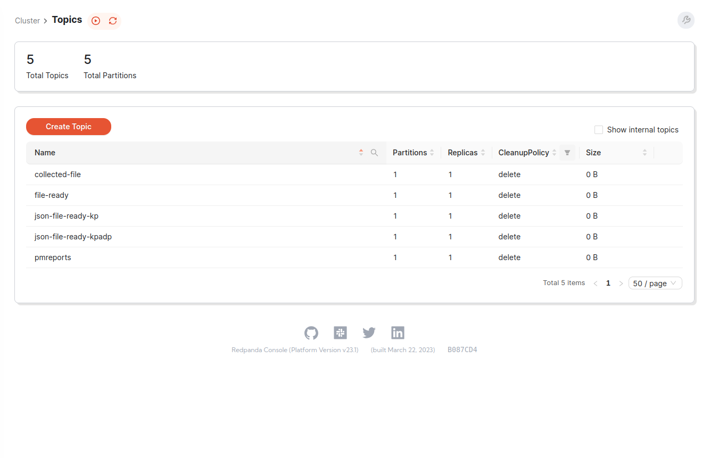
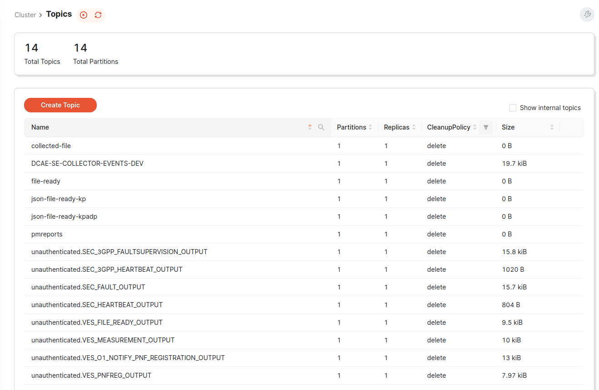

*************************
IOS-MCN SMO Test Cases
*************************

FOCOM
=====

Title
-----

Description
-----------

Expected Result
---------------

Actual Result
-------------

Title
-----

Description
-----------

Expected Result
---------------

Actual Result
-------------

Title
-----

Description
-----------

Expected Result
---------------

Actual Result
-------------

NFO
===
Title
-----

Description
-----------

Expected Result
---------------

Actual Result
-------------

Title
-----

Description
-----------

Expected Result
---------------

Actual Result
-------------

Title
-----

Description
-----------

Expected Result
---------------

Actual Result
-------------

Title
-----

Description
-----------

Expected Result
---------------

Actual Result
-------------

OAM
===
Title
-----
O1 Events/Messages

Description
-----------
This tests sends multiples of different kinds of O1 Events/messages to the ves-collector.

Expected Result
---------------
All events get added Message-Bus.

Actual Result
-------------

Title
-----

Description
-----------

Expected Result
---------------

Actual Result
-------------

Title
-----

Description
-----------

Expected Result
---------------

Actual Result
-------------

Title
-----

Description
-----------

Expected Result
---------------

Actual Result
-------------

NON-RT-RIC
==========

Title
-----

Description
-----------

Expected Result
---------------

Actual Result
-------------

