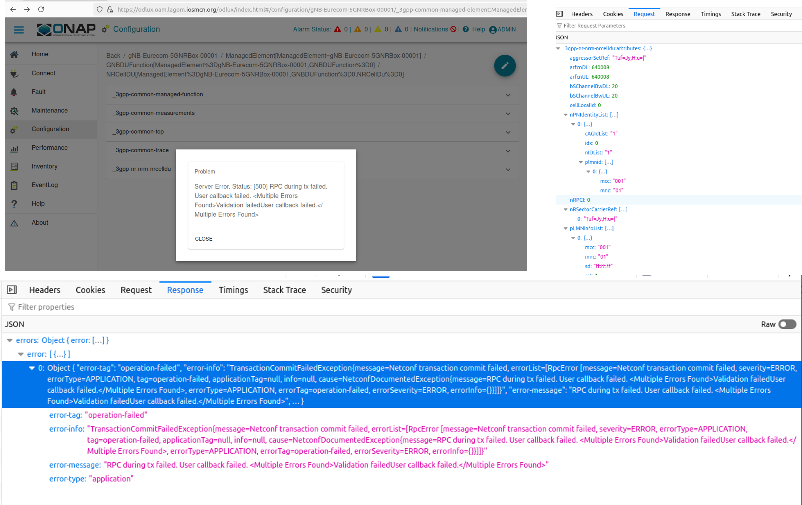

*************************
IOS-MCN SMO Test Cases
*************************

Summary for Release-1:

+------+-------------------+--------+
| sl.no|  Item             |   Count|
+======+===================+========+
|  1   | Total Testcases   |    20  |
+------+-------------------+--------+
|  2   | Testcases run     |    12  |
+------+-------------------+--------+
|  3   | Tests Pass        |    10  |
+------+-------------------+--------+
|  4   | Tests Fail        |     2  |
+------+-------------------+--------+

FOCOM
=====

Title
-----
Cluster Deployment

Description
-----------
This test checks the successful deployment of Kubernetes cluster.

1. Configure the hosts.ini file in the `Kubernetes Repo <https://github.com/ios-mcn-smo/focom/tree/main/kubernetes>`_
2. Run the command make k8s-install

Expected Result
---------------
1. SHould be able to run kubectl commands.
2. Output of kubectl get nodes should match the hosts.ini contents.
3. All pods should be healthy when kubectl get pods --ALL is run.

Actual Result
-------------
Outcome: PASS/FAIL

Title
-----
Docker Deployment

Description
-----------

This test check if the system is ready to run Network-functions and OAM solutions as containers via docker compose.

1. configure the hosts.ini file in the `Docker repo <https://github.com/ios-mcn-smo/focom/tree/main/kubernetes>`_
2. Run the ansible playbook - oam

Expected Result
---------------
1. Docker is installed
2. Necessary packages (jq, keytool, etc.) are installed
3. docker compose is installed.

Actual Result
-------------
Outcome: PASS/FAIL

Title
-----
Node Preparation for RAN Containers.

Description
-----------
This test check if the system is ready to run O-RAN solution as containers via docker compose.

1. configure the hosts.ini file in the `Docker repo <https://github.com/ios-mcn-smo/focom/tree/main/kubernetes>`_
2. Run the ansible playbook - oran

Expected Result
---------------

1. Lnux realtime kernel is installed.
2. Configured CPUs are Isolated.
3. tuned-adm is installed and the profile is set to realtime.
4. linuxptp is insalled.
5. 2 VFs are created and configured correctly.

Actual Result
-------------
Outcome: PASS/FAIL

NFO
===

Title
-----

Deployment of CU/DU, and O1 adapter.

Description
-----------

Tests successful deployment of O-RAN CU/DU and O1 adapter as containers.

1. configure the hosts.ini file in the `OAI Docker repo <https://github.com/ios-mcn-smo/nfo/tree/main/docker>`_
2. Run the command make oai-install

Expected Result
---------------

1. All OAI containers are up and running
2. O1 adapter is also running

Actual Result
-------------
Outcome: PASS/FAIL

Title
-----
Deployment of Core

Description
-----------

Expected Result
---------------

Actual Result:
--------------
Outcome: PASS/FAIL

Title
-----

Deployment of OAM

Description
-----------

Test the successful deployment of OAM
1. Clone the ios-mcn-smo/oam repo
2. Run adapt-to-environment -i <ip> -d <domain-name>
3. run docker-setup.sh

Expected Result
---------------

1. All containers should be up and running.

Actual Result
-------------
Outcome: PASS/FAIL

Title
-----
Integration of RAN and Core

Description
-----------

Expected Result
---------------

Actual Result
-------------
Outcome: PASS/FAIL

Title
-----
Integration of RAN and OAM

Description
-----------

Expected Result
---------------

Actual Result
-------------
Outcome: PASS/FAIL

Title
-----
Integration of Core and OAM

Description
-----------

Expected Result
---------------

Actual Result
-------------
Outcome: PASS/FAIL

Title
-----
Integration of RU and OAM

Description
-----------

Expected Result
---------------

Actual Result
-------------
Outcome: PASS/FAIL

OAM
===
Title
-----
O1 Events/Messages

Description
-----------
This tests sends multiples of different kinds of O1 Events/messages to the ves-collector.

1. Deploy all the OAM containers.
2. Go to ves-client folder.
3. run _example.sh script

Expected Result
---------------
All events get added Message-Bus.

Actual Result
-------------

.. image:: ./images/no-messages.png
  :width: 300
  :height: 200

.. image:: ./images/all-messages.png
  :width: 300
  :height: 300

Title
-----
CU/DU Registration - Event Based

Description
-----------
This test checks if OAM can handle pnfRegistration event and get connected to OAI gNB.

1. Ensure all containers of OAM are running.
2. Start the OAI RAN

Expected Result
---------------

1. pnfRegistration message is seen in the message bus.
2. OAI gNB is connected to SDNC, and the same can be seen in ODLUX GUI.

Actual Result
-------------
Outcome: PASS

Title
-----
CU/DU Registration - Manual

Description
-----------

This test checks if OAM can connected to a running OAI gNB.

1. Ensure all containers of OAM are running.
2. Start the OAI RAN
3. Open OLUX GUI
4. Add details of OAI gNB and connect to it.

Expected Result
---------------

1. OAI gNB is connected to SDNC, and the same can be seen in ODLUX GUI.

Actual Result
-------------
Outcome: PASS

Title
-----
RU Registration - GUI

Description
-----------
This test checks if OAM can connected to a running vendor RU.

1. Ensure all containers of OAM are running.
2. Start the vendor RU
3. Open OLUX GUI
4. Add details of RU and connect to it.

Expected Result
---------------

1. Vendor RU is connected to SDNC, and the same can be seen in ODLUX GUI.

Actual Result
-------------
Outcome: PASS

Title
-----
CU/DU Configuration - GUI

Description
-----------
This test check if a parameter can be configured on gNB using SDNC/SDNC-Web

1. Select the gNB you want to configure.
2. Go to the appropriate parameter (Uplink and Downlink Frequency)
3. Make the changes
4. Commit.
5. Repeat this for other parameters

Expected Result
---------------

1. All parameters should get updated successfully

Actual Result
-------------
Outcome: PASS (with some bug)

Outcome: FAIL

Title
-----
RU Configuration - GUI

Description
-----------
This test check if a parameter can be configured on RU using SDNC/SDNC-Web

1. Select the RU you want to configure.
2. Go to the appropriate parameter
3. Make the changes
4. Commit.
5. Repeat this for other parameters

Expected Result
---------------

1. All parameters should get updated successfully

Actual Result
-------------

Outcome: FAIL

Title
-----
Performance Data gNB

Description
-----------

This test checks if OAM can handle File-Ready events sent by gNB

1. Ensure the gNB is connected and configured to send file-ready events.

Expected Result
---------------

1. File ready message is received and processed.
2. metrics are seen in the InfluxDB
3. JSON and XML files are in the Minio-DB

Actual Result
-------------

Title
-----
Performance Data - RU

Description
-----------

Expected Result
---------------

Actual Result
-------------

Title
-----
Logs Handling - CU/DU

Description
-----------

Expected Result
---------------

Actual Result
-------------

Title
-----
Logs Handling - RU

Description
-----------

Expected Result
---------------

Actual Result
-------------

Title
-----
OAM Core

Description
-----------

Expected Result
---------------

Actual Result
-------------

NON-RT-RIC
==========

Title
-----

Description
-----------

Expected Result
---------------

Actual Result
-------------

